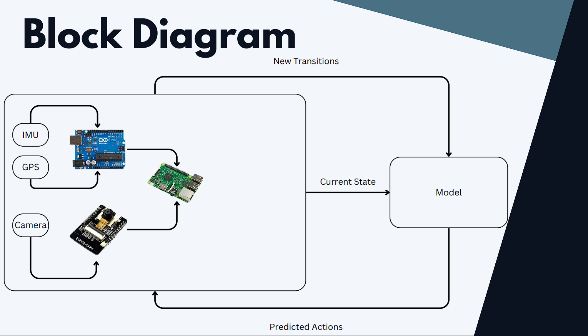
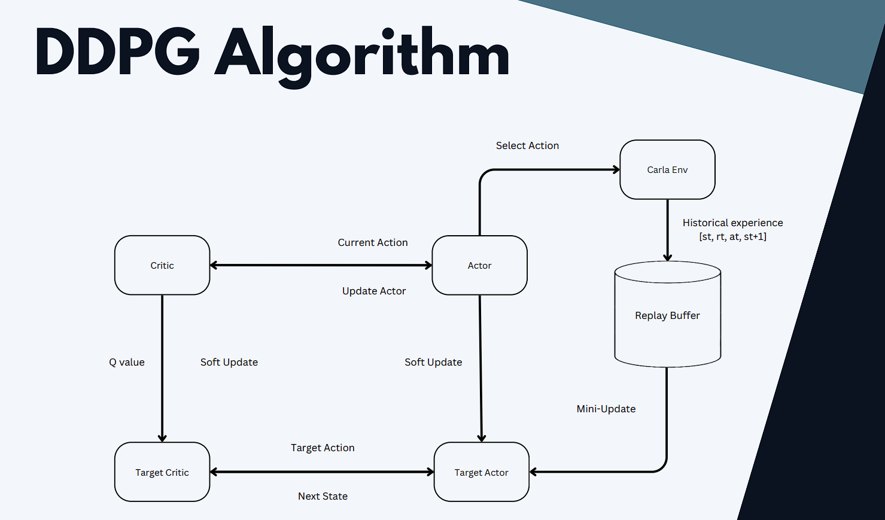
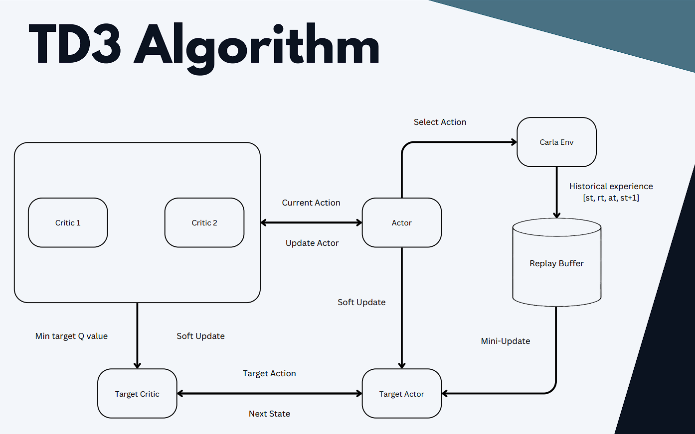
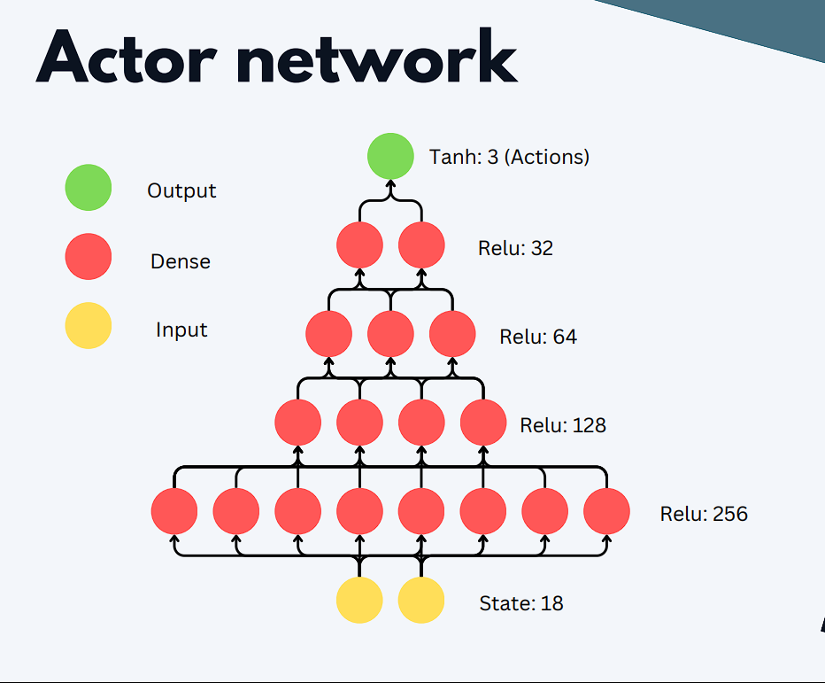
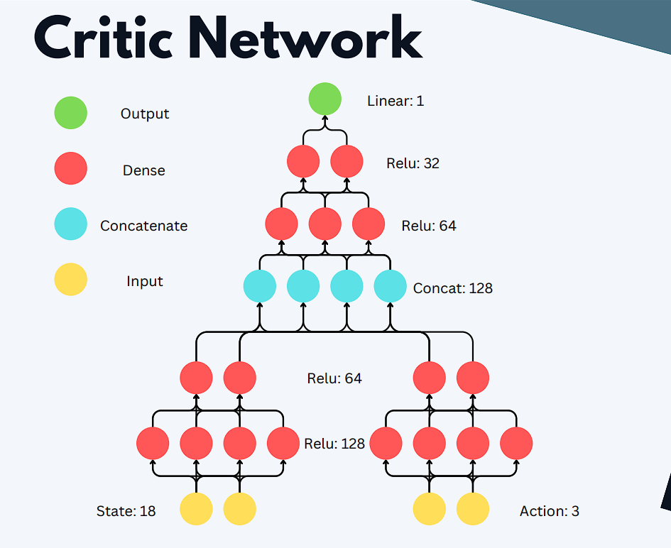

# Intelligent Path Planning for Self-Driving UGV

## Abstract
This project aims to advance intelligent path planning for self-driving Unmanned Ground Vehicles (UGVs) through the application of Deep Reinforcement Learning (DRL). We employ algorithms such as Deep Deterministic Policy Gradient (DDPG) and Twin Delayed Deep Deterministic Policy Gradient (TD3) to enhance the decision-making capabilities of UGVs.

## Sustainable Development Goals (SDGs)
- **SDG 8**: Boosts economic growth by fostering innovation and creating high-end jobs.
- **SDG 9**: Advances smart infrastructure and introduces innovation to existing infrastructure.

## Block Diagram
The system block diagram includes components such as IMU, GPS, Model, Camera, and more to facilitate intelligent path planning.

## Algorithms
### DDPG Algorithm
- Actor-Critic framework
- Utilizes historical experiences to update the model

### TD3 Algorithm
- Improved version of DDPG with twin critics to mitigate overestimation bias

## Network Architectures
### Actor Network
- Input: State (18 dimensions)
- Layers: Relu (256, 128, 64, 32), Tanh (3 - Actions)

### Critic Network
- Input: State (18 dimensions), Action (3 dimensions)
- Layers: Relu (256, 128, 64, 32), Linear (1 - Q value)

## Canny Edge Detection & PCA
- Canny edge detection is used for detecting footpaths, oncoming traffic, and pedestrians.
- PCA is applied for feature reduction to enhance performance.

## Carla Simulator
- Open-source simulator for autonomous driving research.
- Provides realistic environments, varied weather, urban layouts, and traffic scenarios.
- Supports integration with RL frameworks and a wide range of sensors.

## Sensors & Hardware
- **IMU (MPU 6050)**: Measures acceleration and angular velocity, supports up to 1 kHz refresh rate.
- **GPS (GY-NEO6MV2)**: Provides accurate longitude and latitude data, with a refresh rate of 5 Hz.

## Controllers
- Communicates through WebSocket.
- Integrates IMU and GPS data.
- Processes live stream camera data.

## UGV Specifications
- Chassis with two 12V DC wiper motors.
- Weighs around 8kg with a no-load speed of 45 RPM and power output of 14 Watts.

## PyQT GUI
- Main window for autonomous and manual control.

## Results
### Training Process
- Training graphs and data showing the performance of DDPG and TD3 models.

### Tensorboard
- Reward per episode graphs for DDPG and TD3.

## Limitations
- Reduced replay buffer size.
- Slow training due to frame rate issues.
- Power outages and system crashes.

## Conclusion
- Implemented and compared DDPG and TD3 algorithms.
- Manual control through WebSocket and sensor fusion using Arduino UNO.
- Deployed the trained actor model on Raspberry Pi.

## Future Work
- Further training and utilization of more powerful hardware.
- Testing on drone simulators.
- Integration of LiDAR for enhanced environmental perception.
- Improved image processing capabilities.

## References
- Fujimoto, S., Hoof, H., & Meger, D. (2018). Addressing Function Approximation Error in Actor-Critic Methods. arXiv:1802.09477
- Lillicrap, T.P., Hunt, J.J., Pritzel, A., Heess, N., Erez, T., Tassa, Y., Silver, D., & Wierstra, D. (2016). Continuous control with deep reinforcement learning. arXiv:1509.02971
- Dosovitskiy, A., Ros, G., Codevilla, F., López, A., & Koltun, V. (2017). CARLA: An Open Urban Driving Simulator. arXiv:1711.03938
- Sen Wang, Daoyuan, Xinshuo Weng Jia Deep Reinforcement Learning for Autonomous Driving. TORCS: arXiv:1811.11329v3 (2019)

## Institution
- CEME NUST

## Authors
- Awais Raza
- Syed Shuhood
- Zawar Khan
- Syed Shabih Ahmad

## Supervisor
- Dr. Fahad Mumtaz

